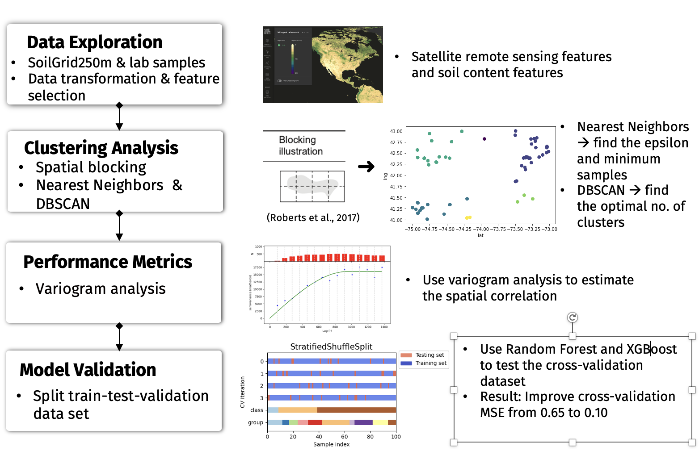

# Analytics Engineer

#### Technical Skills: Python, SQL, R, AWS, Tableau
#### Languages: English(fluent), Chinese Mandarin (Native), Taiwanese (Native)

## Education
- M.S., Technology Management | The University of Illinois at Urbana (_August 2022_)								       		
- M.S., Agronomy, Concentration: Biostatistics and Experimental Design	| National Chung Hsing University (_June 2013_)	 			        		
- B.S., Agronomy, Minor in English Literature | National Chung Hsing University (_June 2010_)

## Work Experience
**Analytics Engineer @ UScellular (_January 2022 - Present_)**
- Develop a approximation method to appoarch tower coverage capacity and evaluate the colocation opportunities which detect 60% coverage capacity and match 25% of UScellular sites for colocation opportunities
- Perform statistical analyses (T-tests and binomial tests) on a dataset of 4.5 million customers, evaluating 3G sunset trials and recommending network performance improvements within the USellular footprint

**Data Scientist Inter @ Bayer (_May 2022 - August 2022_)**
- Developed machine learning models (Decision Tree and Random Forest) using Python, TensorFlow, and geospatial libraries and statistical models (Regression and Linear model) on remote sensing and environmental factors data

**Project Manager @ Sinotech Environmental Technology & Taiwan Water Resources Bureau(_Febuary 2017 - July 2021_)**
- Oversaw a $550K R&D project, achieving a 30% profit margin, while providing data-driven consultations to 9 institutions on environmental, social, and governance (ESG) systems and business operations
- Conducted clustering analysis on 10,000+ energy consumption records and 25 socioeconomic factors, revealing distinct categories of energy consumption behavior
- Designed decision trees using data from 1,000+ consumer questionnaires to identify energy consumption behaviors and validate behavioral assumptions

## Projects
### Enhancing Model Validation with a Machine Learning Approach for Optimal Crop Recommendation

A machine learning-driven validation strategy was developed to assess model accuracy in recommending the best crop of the year. This data-driven approach leveraged satellite remote sensing features and soil content characteristics across geographical variations. By strategically selecting spatial samples and evaluating them through spatial correlation metrics, the method effectively captured regional dependencies. The proposed approach significantly improved cross-validation performance, reducing the Mean Squared Error (MSE) from 0.65 to 0.10.

### EData-Driven Estimation of Energy Consumption Behaviors and Customer Segmentation for Energy Savings

Leveraging **Geographic Information Systems (ArcGIS)** and **Python**, this study developed geometric layers to visualize energy consumption patterns, facilitating targeted sampling area selection. A clustering analysis of 10,000+ energy consumption records and 25 socioeconomic factors uncovered distinct customer energy consumption profiles. Additionally, decision tree models trained on 1,000+ consumer questionnaires identified key behavioral patterns and validated assumptions about energy usage. The insights from this analysis empowered stakeholders to design data-driven energy-saving plans tailored to specific consumer segments.

