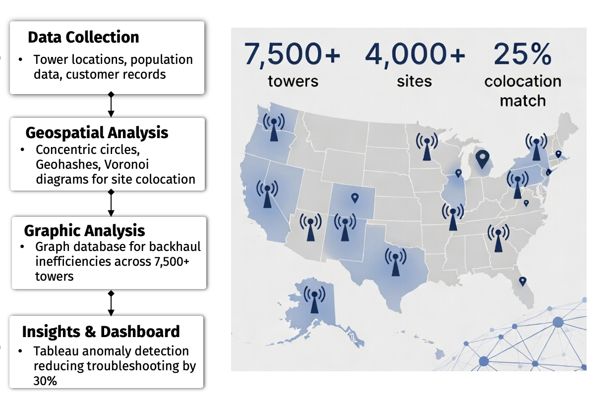
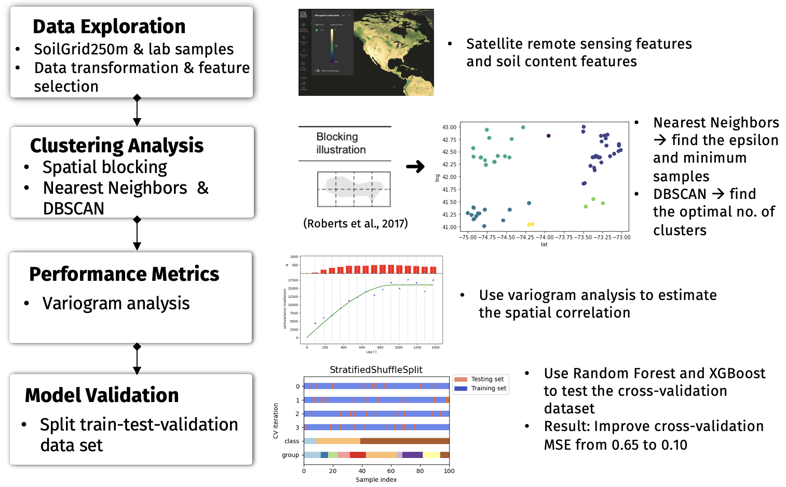

# Analytics Engineer
Results-driven Analytics Engineer with 8+ years of experience in Monte Carlo simulation, geospatial analysis, machine learning anomaly detection, statistical modeling, data visualization and large-scale statistical analysis for risk and operational optimization. Proven track record of transforming complex datasets into actionable insights that optimize operations, reduce costs, and drive strategic decision-making.

#### Technical Skills: Python, SQL, R, Spark, PostgreSQL, OracleDB, AWS, Tableau, Talend, QGIS
#### Languages: English (Fluent), Mandarin Chinese (Native), Taiwanese (Native)

## Education
- M.S., Technology Management | The University of Illinois at Urbana (_August 2022_)		       		
- M.S., Agronomy, Concentration: Biostatistics and Experimental Design	| National Chung Hsing University (_June 2013_)	 			        		
- B.S., Agronomy, Minor in English Literature | National Chung Hsing University (_June 2010_)

## Work Experience
### Analytics Engineer @ UScellular (_acquired by T-Mobile, January 2023 – August 2025_)
- Built a graph database in Python using API data to map backhaul inefficiencies across 7,500+ towers, enabling prioritized resolution of customer-impacting network issues.
- Developed a concentric circle approximation method to quantify geohashes around cell towers, delivering coverage capacity insights for 4,000+ UScellular sites.
- Performed densification analysis combining population data and Voronoi diagrams to identify colocation opportunities with T-Mobile sites, matching 25% of UScellular sites for strategic network expansion.
- Conducted T-tests and binomial tests on 4.5 million customer records to evaluate 3G sunset trials and recommend targeted network performance improvements.
- Spearheaded development of a Tableau handset anomaly detection dashboard used by two cross-functional teams, reducing troubleshooting time by 30%.
- Migrated 50+ Linux shell scripts to Talend, streamlining ETL processes and achieving 25% automation script backup on a centralized platform.
- Extracted and analyzed data from OracleDB, PostgreSQL, and Spark using SQL and Python to deliver monthly executive performance reports.

### Data Scientist Intern @ Bayer (_May 2022 - August 2022_)
- Developed machine learning models (Decision Tree, Random Forest) using Python, TensorFlow, and geospatial libraries on remote sensing and environmental data, reducing RMSE from 0.65 to 0.10.
- Collaborated with two R&D teams to deploy ML models and data pipelines that optimized supply chain logistics and enabled data-driven stakeholder decisions.

### Project Manager @ Sinotech Environmental Technology & Taiwan Water Resources Bureau(_Febuary 2017 - July 2021_)
- Oversaw a $550K R&D project with a 30% profit margin, delivering ESG data-driven consultations to 9 institutions.
- Conducted clustering analysis on 10,000+ energy consumption records and 25 socioeconomic factors to uncover distinct behavioral categories.
- Designed decision trees from 1,000+ consumer questionnaires to identify energy consumption behaviors and validate assumptions.
- Ran Monte Carlo simulations on 10,000+ environmental samples to assess health risks based on hazard ratios of 8 heavy metal contaminants.

## Projects

### Network Performance Optimization & Strategic Site Colocation (_UScellular, 2024–2025_)
Developed advanced geospatial and graph analytics solutions to optimize a nationwide telecom network, directly supporting strategic expansion and reliability improvements during a major acquisition.

- Created a **concentric circle approximation method** with geohashes to quantify coverage capacity for 4,000+ sites.
- Utilized **Voronoi diagrams** and population data to identify colocation opportunities with T-Mobile, successfully matching **25% of UScellular sites** for cost-efficient network densification.
- Built a **graph database** in Python to analyze backhaul inefficiencies across 7,500+ towers, enabling prioritized resolution of customer-impacting issues.
- Spearheaded a **Tableau anomaly detection dashboard** used by two cross-functional teams, reducing troubleshooting time by **30%**.

**Business Impact:** Delivered quantifiable operational efficiency gains and data-driven insights for executive decision-making on network strategy. These geospatial modeling and large-scale analytics skills are highly transferable to utility grid optimization and reliability metrics (e.g., SAIDI/SAIFI).

### Health Risk Assessment of Agricultural Environment (Sinotech, 2017–2019)
Led a multidisciplinary $550K R&D project to quantify environmental and health risks in agricultural areas near industrial zones, providing ESG-driven recommendations to 9 institutions.

- Designed a three-year quantitative sampling plan and experimental framework, collecting over **10,000** in-situ samples and real-time IoT sensor data.
- Applied **Monte Carlo simulations** on real-time and historical datasets to perform probabilistic health risk assessments based on hazard ratios of **8 heavy metals**.
- Collaborated with National Taiwan University Institute of Public Health and 9 institutions to validate models and deliver actionable insights.

**Business Impact:** Achieved **30% profit margin** on the project while enabling data-driven ESG consultations and policy recommendations. This experience demonstrates strong expertise in **simulation modeling, uncertainty quantification, and risk analysis** — directly relevant to ComEd’s portfolio valuation and risk management needs.

### Enhancing Model Validation with a Machine Learning Approach for Optimal Crop Recommendation (Bayer, 2022)
Developed and validated machine learning models to optimize fertilizer recommendations using satellite imagery and remote sensing data.

- Built **Decision Tree and Random Forest models** with Python, TensorFlow, and geospatial libraries.
- Implemented spatial sampling and correlation metrics in an **AWS-based data pipeline** to address regional dependencies.
- Reduced **RMSE from 0.65 to 0.10**, significantly improving model accuracy and reliability.

**Business Impact:** Enabled R&D teams to make more precise, data-driven supply chain decisions, reducing waste and optimizing resource allocation in agricultural applications. The end-to-end ML pipeline and validation expertise align with developing robust predictive models for utility forecasting and pricing.

### Data-Driven Estimation of Energy Consumption Behaviors and Customer Segmentation (Taiwan Water Resources Bureau, 2019–2021)
Conducted advanced clustering and decision tree analysis to support energy-saving initiatives and policy design.

- Utilized **ArcGIS and Python** to create geometric layers visualizing energy consumption patterns and identify target sampling areas.
- Performed **clustering analysis** on **10,000+** energy consumption records combined with 25 socioeconomic factors.
- Designed **decision trees** from **1,000+** consumer questionnaires to identify behavioral drivers and validate assumptions.

**Business Impact:** Revealed distinct consumer profiles, enabling stakeholders to design targeted energy-saving strategies and improve demand-side management — skills transferable to utility customer analytics and reliability planning.

